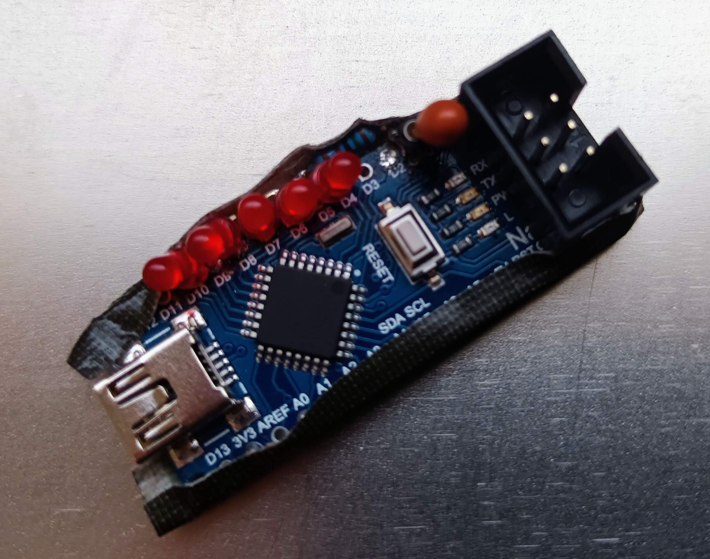
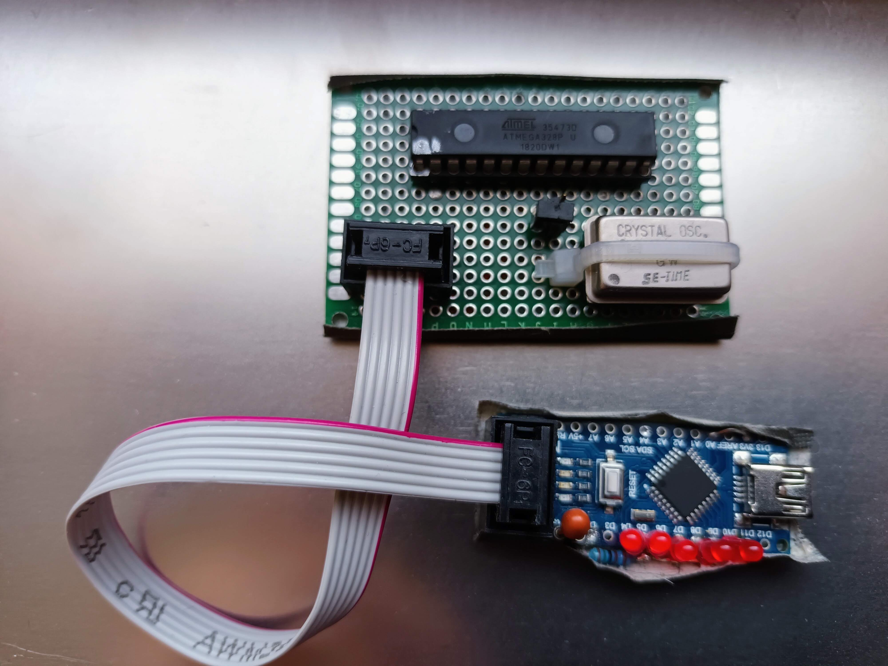

# nanoSTK_V1



## Using Arduino Nano as AVR ISP with STK500 v1 protocol

This project enables the use of an Arduino Nano board with minor modifications (nanoSTK)
as the [fastest](README.md#programming-speed) DIY in-system programmer (ISP) for classic AVR devices such as ATtiny and ATmega
together with a programming software, e.g. [AVRDUDE](https://github.com/avrdudes/avrdude/).

The program is based on:
[ArduinoISP](https://github.com/rsbohn/ArduinoISP) - Copyright (c) 2008-2011 Randall Bohn

## Programmer Hardware

The programming process uses VCC, GND and four data pins.
By default, the hardware SPI pins MISO, MOSI and SCK are used to communicate with the target.
The fourth pin (D10) from the programming microprocessor goes to the reset pin of the target.
On all Arduinos, these pins are found on the ICSP/SPI header:

```
              MISO ¹* * 5V (!)
              SCK   * * MOSI
       D10 (/RESET) * * GND
```

### HW Modifications for nanoSTK

#### Required HW Changes

- Cut ISP header /RESET connection and connect this pin to D10 (PB2).
- Connect a capacitor of about 3..10 μF between the /RESET line (+) of the Nano and GND (-).
  This capacitor must be removed to reprogram the nanoSTK.
  It is therefore recommended to make the capacitor pluggable.

```
/RESET ---o<---|(--->o--- GND
              +  -
```

With this setup the modified nanoSTK provides the supply voltage of 5 V to the target.

#### Optional Modifications (Status LEDs)

Connect LEDs (with resistor to GND) to the following active high pins:

```
Heartbeat - Indicates that the programmer is running
D9 (PB1) ----|>|----/\/\---- GND
             LED1    R1

Error     - An Error has occured - clear with programmer reset
D8 (PB0) ----|>|----/\/\---- GND
             LED2    R2

Write     - Writing to the target
D7 (PD7) ----|>|----/\/\---- GND
             LED3    R3

Read      - Reading from the target
D6 (PD6) ----|>|----/\/\---- GND
             LED4    R4

PMode     - Target in programming mode
D5 (PD5) ----|>|----/\/\---- GND
             LED5    R5
```

D5 .. D8 are identical to the [ScratchMonkey](https://github.com/microtherion/ScratchMonkey) status LED pins.

## Firmware Development and Installation

The source code was originally created and tested with the *Arduino* toolchain
version 1.8.19 under Linux, *Debian stable*.
Starting with version 1.50, the build process is no longer dependent on the *Arduino* toolchain.
You only need the *avr-gcc* toolchain.

The `Makefile` takes care of changes to the source code files and rebuilds the file
`nanoSTK.hex` accordingly - just type `make`

The installation process is simple and straightforward from the command line:

- Remove the *reset capacitor* from your *nanoSTK* HW.
- Connect the device to USB.
- Enter `make upload`
- Re-install the *reset capacitor*.

Instead of removing/inserting the *reset capacitor* you can also press the reset button
as soon as the `avrdude` command is started.
The upload of the file `nanoSTK.hex` with `make upload` only requires the `avrdude` tool.
If the source code remains unchanged, the *avr-gcc* tool chain is not required.

### Other OS

You can also use the Arduino tool chain, this should work on all supported operation systems.
Check out the source and hex files from the branch
[`arduino_toolchain`](https://github.com/Ho-Ro/nanoSTK_V1/tree/arduino_toolchain).

- Remove the *reset capacitor* from your *nanoSTK* HW.
- Connect the device to USB.
- Open `nanoSTK_V1/nanoSTK_V1.ino` with the Arduino tool chain.
- Select `Tools/Board: "Arduino Nano"`.
- Select the correct serial port.
- Execute `Sketch/Upload` from the menu.
- Reinstall the *reset capacitor*.

The upload of the file `nanoSTK_V1.hex` with `make upload` only requires the `avrdude` tool.
If the source code remains unchanged, the *Arduino* tool chain is not required.
The branch `arduino_toolchain` will not be developed regularly
and will not receive any new features, only critical bugs will be fixed.

## Usage

The communication uses the `stk500v1` protocol over serial USB with a data rate of 115200 bps, this is the default speed of `avrdude`.
As serial communication is the bottleneck, you can speed up programming or reading considerably with a higher `BAUDRATE` setting in the FW.

### Config File .avrduderc

Put this file into your home directory (Linux) to set the nanoSTK device as the default programmer:

```
# file ~/.avrduderc

#------------------------------------------------------------
# nanoSTK
#------------------------------------------------------------

# this is the same as `-c stk500v1`
# but has different features
# warning: "extra_features" is not supported for avrdude version < 7.2
# adjust the baudrate (default = 115200) if you have changed the `BAUDRATE` value in the FW
# available values are 500000 bps or 1000000 bps

programmer # nanoSTK
    id                     = "nanoSTK";
    desc                   = "nanoSTK - arduino nano programmer using stk500v1 protocol";
    type                   = "stk500";
    prog_modes             = PM_ISP;
#    baudrate               = 500000;
#    extra_features         = HAS_VTARG_READ | HAS_FOSC_ADJ;
    connection_type        = serial;
;

default_programmer  = "nanoSTK";

default_serial = "/dev/ttyUSB0";
```

### Use with AVRDUDE

A typical call for programming the file `firmware.hex` into an ATtiny 85 looks like this:

```sh
avrdude -p t85 -U flash:w:firmware.hex:i
```

This simple call

```sh
avrdude -p t85 -v
```

will show the programmer setup and device info for the ATtiny 85:

```
$ avrdude-git -pt85 -v

avrdude-git: Version 7.2-20231122 (606658a1)
             Copyright the AVRDUDE authors;
             see https://github.com/avrdudes/avrdude/blob/main/AUTHORS

             System wide configuration file is /home/horo/projects/AVR/avrdude/build_linux/src/avrdude.conf
             User configuration file is /home/horo/.avrduderc

             Using port            : /dev/ttyUSB0
             Using programmer      : nanoSTK
             AVR Part              : ATtiny85
             Programming modes     : ISP, HVSP, debugWIRE, SPM
             Programmer Type       : STK500
             Description           : nanoSTK - arduino nano programmer using stk500v1 protocol
             HW Version            : 2
             FW Version            : 1.51
             Vtarget               : 4.8 V
             Oscillator            : 8.000000 MHz
             SCK period            : 1.0 us
             XTAL frequency        : 16.000000 MHz
avrdude-git: AVR device initialized and ready to accept instructions
avrdude-git: device signature = 0x1e930b (probably t85)

avrdude-git done.  Thank you.

```

### Programming Speed

The programming algorithms are optimised for speed:

- unchanged EEPROM blocks are not programmed.
- the total serial communication overhead is taken into account for the required programming delays.

These times were measured on an ATmega328p and an ATtiny85 with random data after flash and EEPROM were filled with `0xFF`.

Device | Flash/EEPROM | Flash write | Flash verify | EEPROM write | EEPROM verify
-------|--------------|-------------|--------------|--------------|---------------
m328p  | 32K / 1024   |      5.63 s |       4.36 s |       1.79 s |        1.77 s
t85    | 8K / 512     |      1.91 s |       1.54 s |       0.90 s |        0.89 s

#### Comparison With Other Programmer FW

Comparison between the original STK500 and three FW variants for the modified Arduino Nano board, see also the [detailed documentation](timing_benchmark.md):

- Target: ATmega328p 8MHz internal clock - flash memory
- Data: 32K random data

Programmer      | Flash write | Flash verify
----------------|-------------|-------------
STK500          | 12.28 s     | 11.31 s
arduino as ISP  | 36.61 s     | 20.21 s
ScratchMonkey   |  8.18 s     |  7.97 s
nanoSTK         |  6.15 s     |  4.36 s
nanoSTK 500kbps |  3.84 s     |  3.33 s

The serial USB communication becomes the clear bottleneck, you can speed up further with higher `BAUDRATE` setting in the FW,
e.g. a speed of 500 kbps significantly reduces the programming time.

### Programming Slow Targets

When programming targets with a clock speed lower than 4 MHz the SPI can be slowed down from 1 MHz to 125 kHz,
this allows to communicate with slow targets (clock >= 500 kHz), e.g. using the default setup (internal 8 MHz oscillator divided by 8).
To slow down connect pin D2 with GND and press the reset button. You can also use the terminal command `sck 8`.

### Providing External Clock

To program a target without own clock generation, e.g. a processor on an adapter board, an external 8 MHz clock (5 V) is provided on pin D3.
This frequency is lowered to 1 MHz when pin D2 is connected to GND during reset.
The clock frequency can be changed with the terminal command `fosc`, e.g. `fosc 100k` sets 100 kHz.

## Programming Protocol

The nanoSTK firmware uses the STK500 protocol, version 1 (`stk500v1`) as default.

**Caution!** The  Arduino bootloader uses a modified version of the `stk500v1` protocol, called `arduino`,
even if describing it as *"Arduino for bootloader using STK500 v1 protocol"*:

- **EEPROM access is handled differently:**
- Original `stk500v1` uses byte addresses (e.g 0..1023 for a device with 1K EEPROM).
- Modified `arduino` uses word addresses also for the EEPROM (0..511 for a 1K device).
- The `arduino` protocol does not support Vtarget and Varef.
- The `stk500v1` protocol uses three `Cmnd_STK_UNIVERSAL` (0x56 = 'V') calls to get the signature.
- The `arduino` protocol retrives the signature with the command `Cmnd_STK_READ_SIGN` (0x75 = 'u').

The firmware automatically recognises the modified `arduino` protocol by its use of the command
`Cmnd_STK_READ_SIGN` and adjusts the EEPROM addressing accordingly.

```
$ avrdude -p t85 -c arduino -v
         ...
         Programmer Type : Arduino
         Description     : Arduino for bootloader using STK500 v1 protocol
         Hardware Version: 2
         Firmware Version: 1.27

avrdude: AVR device initialized and ready to accept instructions
avrdude: device signature = 0x1e930b (probably t85)

avrdude done.  Thank you.
```

## Comparison With Original STK500

If you work professionally with classic AVR processors, you can hardly avoid the
[STK500](https://www.microchip.com/en-us/development-tool/atstk500);
I also use it for development. However, two things speak against using it for programming
ready targets via ISP: it requires an external power supply and needs space on the table.
This is where my nanoSTK comes into play, small, robust thanks to the use of the nano-ISP
connector, transportable and stand-alone, even when travelling.
In addition, my nanoSTK programs much faster than my STK500.



I took the Arduino *Sketch* *Arduino as ISP* as a basis and optimised it for robustness
and speed. Furthermore, I added the handling of LEDs for status indication and generate
a clock signal for programming AVR processors that require an external clock, e.g. a
*naked* processor on a simple adapter board. The status LEDs are on the same port pins
as on the [ScratchMonkey](https://github.com/microtherion/ScratchMonkey), as I initially
used this firmware on my hardware. Sadly, this project is no longer being actively developed
and is much more complex to modify due to its greater flexibility (more Arduino boards as
platform, hi-voltage programming etc.).
I don't need these functions, I use my good old STK500 for that.
